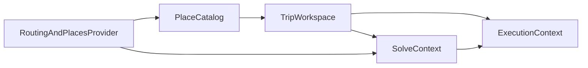

# Generalized Travel Planner Backend RFC

Status: Draft  
Audience: Backend, product, solver, data model owners  
Scope: Single-day, single-user planner backend  
Related docs:

- [GENERALIZED_TRAVEL_PLANNER_SPEC.md](GENERALIZED_TRAVEL_PLANNER_SPEC.md)
- [GENERALIZED_TRAVEL_PLANNER_FRONTEND_UX_SPEC.md](GENERALIZED_TRAVEL_PLANNER_FRONTEND_UX_SPEC.md)
- [GENERALIZED_TRAVEL_PLANNER_API_CONTRACT.md](GENERALIZED_TRAVEL_PLANNER_API_CONTRACT.md)

Current code anchors:

- [backend/app/api/routes/trips.py](backend/app/api/routes/trips.py)
- [backend/app/api/routes/pois.py](backend/app/api/routes/pois.py)
- [backend/app/models/trip.py](backend/app/models/trip.py)
- [backend/app/models/poi.py](backend/app/models/poi.py)
- [backend/app/schemas/trip.py](backend/app/schemas/trip.py)
- [backend/app/schemas/poi.py](backend/app/schemas/poi.py)
- [backend/app/services/routing_costs.py](backend/app/services/routing_costs.py)
- [backend/app/solver/model.py](backend/app/solver/model.py)
- [backend/app/solver/replanner.py](backend/app/solver/replanner.py)

## 1. Problem Statement

The current backend is optimized for a specific Boso day-drive product shape:

- seed-driven candidate initialization
- fixed place categories such as lunch, dinner, sweets, sunset
- fixed trip preferences such as lunch tags, dinner tags, and must-have-cafe
- solver rules embedded as code rather than persisted rule objects
- execution state derived from events plus latest solve

This RFC defines the backend target state for a generalized travel planner where:

- the place catalog is self-sufficient without seed dependency
- trip candidates are user-built and trip-local
- rules are persisted data with explicit hard and soft semantics
- solve preview and accepted solve are distinct backend concepts
- execution and replan operate on canonical accepted runs

## 2. Goals

- Remove product dependency on seed data for core planning flows.
- Replace fixed meal- and category-based solver logic with a generic rule system.
- Preserve fail-fast, no-fallback, and contract-first behavior from [AGENTS.md](AGENTS.md).
- Keep the backend as the canonical source of truth for:
  - trip frame
  - candidate pool
  - rule set
  - accepted solve
  - execution state
- Support low-latency preview interactions without weakening core solve contracts.

## 3. Non-Goals

- Multi-day itinerary modeling
- Multi-user collaboration or auth
- Provider replacement in v1
- Full offline editing or sync conflict resolution

## 4. Architecture Principles

### 4.1 Contract-First

Every planning, solve, and execution surface must be represented by explicit typed schemas. The frontend must not rebuild accepted solve or execution state from fragments.

### 4.2 No Silent Degradation

Preview is allowed to be faster than accepted solve, but it may not silently use incomplete, estimated, or partial routing for core timing decisions.

### 4.3 Rules As Data

Rule evaluation, validation, scoring, and carry-forward semantics must be driven by persisted rule objects, not by hard-coded category checks.

### 4.4 Historical Immutability

Accepted solve runs and executed stop history must remain readable even after later replans or data-model upgrades.

## 5. Current System Constraints To Replace

| Current assumption | Current anchor | Required replacement |
|---|---|---|
| New trips auto-load seed candidates | [backend/app/db/seed.py](backend/app/db/seed.py), [backend/app/api/routes/trips.py](backend/app/api/routes/trips.py) | Trip frame creation without implicit candidates |
| Solver depends on fixed categories | [backend/app/solver/model.py](backend/app/solver/model.py), [backend/app/services/routing_costs.py](backend/app/services/routing_costs.py) | Generic persisted rule engine |
| Start/end are modeled as special POI categories | [backend/app/models/poi.py](backend/app/models/poi.py), [backend/app/api/routes/trips.py](backend/app/api/routes/trips.py) | Trip frame origin/destination nodes outside place catalog |
| Weather is a special top-level mode | [backend/app/models/trip.py](backend/app/models/trip.py) | Context-aware rules and execution conditions |
| Execution state is derived from latest solve + events only | [backend/app/api/routes/trips.py](backend/app/api/routes/trips.py), [backend/app/solver/replanner.py](backend/app/solver/replanner.py) | First-class execution session with active run pointer |

## 6. Target Bounded Contexts

### 6.1 Place Catalog

Responsibilities:

- provider search
- import
- manual place creation
- metadata editing
- source record storage
- trait/tag normalization
- availability rule storage

Main successors of current code:

- `PoiMaster` -> `Place`
- `PoiPlanningProfile` -> `PlaceVisitProfile`
- `PoiOpeningRule` -> `PlaceAvailabilityRule`
- `PoiSourceSnapshot` -> `PlaceSourceRecord`

### 6.2 Trip Workspace

Responsibilities:

- trip frame lifecycle
- candidate pool management
- rule CRUD
- working-state transitions
- accepted working run pointer

Main successors of current code:

- `TripPlan` -> `Trip`
- `TripCandidate` -> enriched `TripCandidate`
- `TripPreferenceProfile` -> split into generic preferences and explicit rules

### 6.3 Solve Context

Responsibilities:

- preview generation
- accepted solve generation
- explanation payloads
- route geometry
- travel matrix construction
- cache and request logging

Main successors of current code:

- `SolverRun` -> `SolveRun`
- `PlannedStop` -> `SolveStop`
- routing pipeline remains, but consumes rule data instead of category-specific logic

### 6.4 Execution Context

Responsibilities:

- execution session start and completion
- execution events
- active run tracking
- replan preview
- accepted replan persistence
- rule carry-forward evaluation

Main successors of current code:

- `TripExecutionEvent` -> `ExecutionEvent`
- new `ExecutionSession`

## 7. Domain Model

### 7.1 Trip

`Trip` is the aggregate root for the planning lifecycle.

Required fields:

- `id`
- `title`
- `plan_date`
- `origin_label`
- `origin_lat`
- `origin_lng`
- `destination_label`
- `destination_lat`
- `destination_lng`
- `departure_window_start_min`
- `departure_window_end_min`
- `end_constraint_kind`
- `end_constraint_minute_of_day`
- `state`
- `timezone`

Notes:

- start and destination are frame nodes, not places
- `end_constraint_kind` replaces the current single `return_deadline_min`

### 7.2 TripCandidate

Trip-local candidate state must support:

- `candidate_state`
  - `active`
  - `excluded`
  - `archived_from_trip`
- `priority`
  - `must`
  - `high`
  - `normal`
  - `low`
  - `backup`
- `locked_in`
- `locked_out`
- `utility_override`
- `stay_override_min`
- `stay_override_preferred`
- `stay_override_max`
- `arrive_after_min`
- `arrive_before_min`
- `depart_after_min`
- `depart_before_min`
- `manual_order_hint`
- `user_note`

This is a hard break from the current boolean-centric model in [backend/app/models/trip.py](backend/app/models/trip.py).

### 7.3 TripRule

Each `TripRule` must store:

- `trip_id`
- `rule_kind`
- `scope`
- `mode`
- `weight`
- `target_kind`
- `target_payload`
- `operator`
- `parameters`
- `carry_forward_strategy`
- `label`
- `description`
- `created_by_surface`

The rule system is generic at the data-model level, but v1 exposes a closed, validated subset.

### 7.4 SolvePreview

`SolvePreview` is not persisted as a full durable run in v1, but it is still a backend concept with:

- `preview_id`
- `trip_id`
- `workspace_version`
- `based_on_run_id`
- `expires_at`

The preview payload uses the same canonical stop and timing contract as accepted solve.

### 7.5 SolveRun And SolveStop

Accepted solve state must be persisted in:

- `SolveRun`
  - summary
  - explanation data
  - accepted_at
  - run_kind
    - `planned`
    - `replan`
- `SolveStop`
  - canonical ordered stop representation

Historical runs must remain immutable and readable.

### 7.6 ExecutionSession

Execution requires a first-class session with:

- `trip_id`
- `active_run_id`
- `status`
- `started_at`
- `completed_at`
- `current_stop_id`
- `suffix_origin_kind`
- `suffix_origin_payload`

The session owns the canonical pointer to the active accepted run during the trip.

## 8. Lifecycle And State Transitions

Allowed trip-state transitions:

- `draft -> working`
- `working -> confirmed`
- `confirmed -> working`
- `confirmed -> active`
- `active -> completed`
- `completed -> archived`

Backend rules:

- only accepted solve can move `working -> confirmed`
- only execution start can move `confirmed -> active`
- `active -> working` is forbidden
- archival must not delete historical runs or execution events

## 9. Rule Engine And Solver Integration

### 9.1 Normative V1 Rule Kinds

Supported in v1:

- `selection_count`
- `selection_exclude`
- `preference_match`
- `order_dependency`
- `arrival_window`
- `stay_duration`
- `continuous_travel_limit`
- `context_filter`

The backend must implement a validation matrix for:

- allowed operators per rule kind
- allowed modes per rule kind
- required parameters
- allowed target shapes

### 9.2 Hard And Soft Semantics

Hard rules:

- must be satisfied
- otherwise solve is infeasible

Soft rules:

- may be violated
- must return:
  - violation status
  - score impact
  - explanation

### 9.3 Predicate DSL

Predicates in v1 must support:

- place id
- tag membership
- trait equality
- source equality
- price band set
- rating threshold
- distance threshold

Arbitrary nested boolean expression builders are out of scope for v1 UI, even if the backend keeps an internal typed predicate DSL.

### 9.4 Carry-Forward On Replan

When replanning:

- completed prefix remains immutable
- in-progress stop is treated as current context
- satisfied rules may be marked satisfied and carried as fulfilled
- active rules continue to apply to the remaining suffix
- impossible past-window rules return explicit explanation status

## 10. Preview And Accepted Solve

### 10.1 Preview Requirements

Preview must:

- be non-persistent
- always return `preview_id`
- always return `workspace_version`
- use canonical stop and timing contracts
- fail explicitly if complete routing data is unavailable

Preview must not:

- silently use estimated timings
- silently solve a changed workspace

### 10.2 Accepted Solve Promotion

Accepted solve may be created from:

- current canonical workspace state
- promoted preview

If promoted from preview:

- `preview_id` is required
- `workspace_version` is required
- version mismatch must return conflict

### 10.3 Solve Output Requirements

Accepted solve and preview payloads must include:

- summary
- stops
- route legs
- selected place ids
- unselected candidate diagnostics
- rule results
- warnings
- alternatives

This is a contract expansion from the current `reason_codes`-driven shape in [backend/app/schemas/trip.py](backend/app/schemas/trip.py).

## 11. Execution And Replan Semantics

### 11.1 Execution Start

Execution start:

- requires a confirmed trip
- creates `ExecutionSession`
- sets `active_run_id`
- moves trip to `active`

### 11.2 Execution Events

V1 event types:

- `arrived`
- `departed`
- `skipped`
- `delayed`
- `inserted_stop`
- `removed_stop`
- `note_added`

Events remain append-only.

### 11.3 Replan Preview

Replan preview:

- uses current execution context
- may include draft candidate or rule overrides
- does not persist any canonical state

### 11.4 Accepted Replan

Accepted replan must:

- create a new `SolveRun`
- preserve the completed prefix
- update `ExecutionSession.active_run_id`
- become canonical for the remaining suffix
- persist any accepted execution-time candidate or rule changes in the same transaction

## 12. Migration Strategy

### 12.1 Seed Dependency Removal

New trip creation must stop relying on:

- `TRIP_CANDIDATE_SEED_KEYS`
- `DEFAULT_MUST_VISIT_SEED_KEYS`
- any implicit seed-derived candidate population

Seed data may remain only as development/demo data.

### 12.2 Preference Migration

Current `TripPreferenceProfile` values must be migrated into:

- generic preferences
- generated `TripRule` rows where appropriate

Examples:

- `must_have_cafe` -> selection rule on tag `cafe`
- lunch/dinner preference lists -> soft preference rules

### 12.3 Historical Data Preservation

Existing rows must remain readable:

- `TripPlan`
- `TripCandidate`
- `SolverRun`
- `PlannedStop`
- `TripExecutionEvent`

Adapters or compatibility serializers may be needed during migration.

## 13. Validation And Test Strategy

### 13.1 Contract Tests

Required coverage:

- place catalog CRUD
- trip creation without seed dependency
- candidate override validation
- rule validation matrix behavior
- preview promotion version mismatch
- accepted replan active run update

### 13.2 Solver Scenario Tests

Required scenarios:

- no seed data
- conflicting hard rules
- soft-rule tradeoff
- opening-window conflict
- ordering rule
- stay override
- execution carry-forward after satisfied rule

### 13.3 Regression Anchors

Current test anchors to evolve:

- [backend/tests/test_api_trips.py](backend/tests/test_api_trips.py)
- [backend/tests/test_api_pois.py](backend/tests/test_api_pois.py)
- [backend/tests/test_solver_scenarios.py](backend/tests/test_solver_scenarios.py)
- [backend/tests/test_replanning.py](backend/tests/test_replanning.py)

## 14. Open Backend Decisions For The Next RFC Pass

These are intentionally left for implementation planning, not for this target-state RFC:

- exact ORM schema and migration sequence
- preview storage TTL mechanism
- whether `SolvePreview` is purely ephemeral or backed by a temporary table
- how provider normalization is layered inside services
- whether execution snapshot is fully materialized or partially derived

