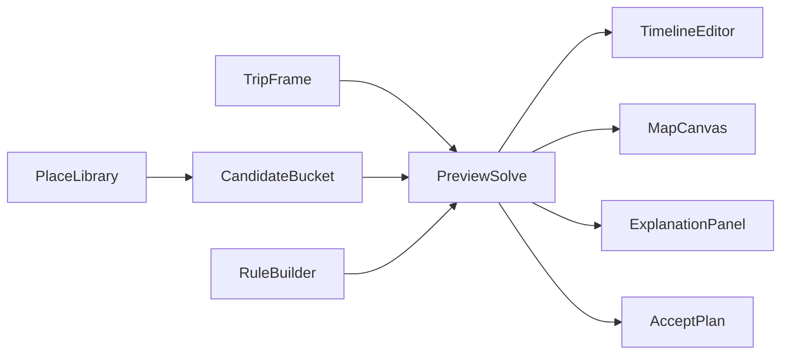

# Generalized Travel Planner Frontend UX Specification

Status: Draft  
Audience: Frontend, design, product  
Scope: Single-day, single-user planning and execution UX  
Related docs:

- [GENERALIZED_TRAVEL_PLANNER_SPEC.md](GENERALIZED_TRAVEL_PLANNER_SPEC.md)
- [GENERALIZED_TRAVEL_PLANNER_BACKEND_RFC.md](GENERALIZED_TRAVEL_PLANNER_BACKEND_RFC.md)
- [GENERALIZED_TRAVEL_PLANNER_API_CONTRACT.md](GENERALIZED_TRAVEL_PLANNER_API_CONTRACT.md)

Current frontend anchors:

- [frontend/src/app/trips/new/page.tsx](frontend/src/app/trips/new/page.tsx)
- [frontend/src/app/trips/[id]/page.tsx](frontend/src/app/trips/[id]/page.tsx)
- [frontend/src/app/trips/[id]/active/page.tsx](frontend/src/app/trips/[id]/active/page.tsx)
- [frontend/src/components/RouteMap.tsx](frontend/src/components/RouteMap.tsx)
- [frontend/src/lib/types.ts](frontend/src/lib/types.ts)
- [frontend/src/lib/trip-create.ts](frontend/src/lib/trip-create.ts)
- [frontend/src/lib/active-trip.ts](frontend/src/lib/active-trip.ts)

## 1. UX Vision

The generalized planner should feel like a combination of:

- a map-first research tool
- a trip-specific editing workspace
- a route simulator
- a lightweight execution console for the actual travel day

The UX must shift the current product from "fill a form and run solve" to "collect places, shape intent, preview options, accept a plan, then adapt it live."

## 2. UX Principles

### 2.1 Exploration First

Users should be able to search, browse, import, and collect places before they are forced to commit to a route.

### 2.2 Intent Over Knobs

The interface should help users express intent in human terms:

- "I want one scenic cafe"
- "I want to arrive here after lunch"
- "Avoid outdoor stops if rain"

The UI should not expose solver internals as primary controls.

### 2.3 Preview Before Commit

Every material edit should support a preview state before it becomes canonical.

### 2.4 Explain The Tradeoff

If the system changes the route, drops a candidate, or marks a rule infeasible, the UI must show why in plain language.

### 2.5 Planning And Execution Are Separate UX Modes

Planning mode should be dense, comparative, and map-heavy. Execution mode should be calm, focused, and current-context-first.

## 3. Primary User Journeys

### 3.1 Discovery Journey

1. Open the place library or search from the planning workspace.
2. Search by text, map area, or manual creation.
3. Review place details.
4. Add places to the trip bucket.

Desired UX outcome:

- user can collect candidates quickly without thinking about final order

### 3.2 Planning Journey

1. Set trip frame
2. Add or remove candidates
3. Define rules
4. Preview the route
5. Refine with drag-and-drop, locks, and rule edits
6. Accept one solve run as the working plan

Desired UX outcome:

- user feels in control of tradeoffs and can understand solver decisions

### 3.3 Execution Journey

1. Start execution from a confirmed plan
2. Follow current stop and next stop guidance
3. Record arrival, departure, skip, or delay
4. Accept a replan if needed

Desired UX outcome:

- user can recover from reality changes without losing trust in the plan

## 4. Route And Screen Architecture

Future route surface:

- `/`
  - dashboard
  - recent trips
  - create trip entry
- `/places`
  - reusable place library and management
- `/trips/new`
  - trip frame creation
- `/trips/[tripId]`
  - planning workspace
- `/trips/[tripId]/compare`
  - compare preview, accepted, and historical runs
- `/trips/[tripId]/execute`
  - execution mode

Current routes to evolve:

- [frontend/src/app/trips/new/page.tsx](frontend/src/app/trips/new/page.tsx)
- [frontend/src/app/trips/[id]/page.tsx](frontend/src/app/trips/[id]/page.tsx)
- [frontend/src/app/trips/[id]/active/page.tsx](frontend/src/app/trips/[id]/active/page.tsx)

## 5. Screen Specifications

### 5.1 Dashboard

Purpose:

- resume recent work
- create a new trip
- re-enter active execution quickly

Key regions:

- recent trips list
- current active trip card if any
- create-new button
- archived trips access

### 5.2 Place Library

Purpose:

- manage the global place catalog

Key regions:

- search bar
- map area search controls
- filters for tags, traits, source, archived
- result grid or list
- place detail drawer
- manual create form
- import override sheet

Primary actions:

- add to trip
- import
- edit metadata
- archive/unarchive

### 5.3 Trip Creation

Purpose:

- create a trip frame only

Key regions:

- title input
- date picker
- origin picker
- destination picker
- departure window controls
- end constraint controls
- timezone display
- create action

Notes:

- this screen must not ask the user to pre-select all candidates before entering the planning workspace
- current Tokyo/Japan defaults from [frontend/src/app/trips/new/page.tsx](frontend/src/app/trips/new/page.tsx) must be removed from product logic

### 5.4 Planning Workspace

This is the main product surface.

Desktop layout:

- left pane
  - place search
  - candidate bucket
  - rule builder
- center pane
  - planning map canvas
  - place overlays
  - route overlay
- right pane
  - summary bar
  - timeline editor
  - explanation panel

Top-level actions:

- preview
- accept plan
- compare
- start execution

### 5.5 Compare View

Purpose:

- compare the current accepted run against a new preview or a historical run to understand tradeoffs before committing.

Entry points:

- "Compare" button in the `SolveSummaryBar` when a preview is active.
- "History" drawer to select a past run and compare it with the current accepted plan.

Key regions:

- summary diff header (e.g., "+15 min drive, -1 stop")
- timeline diff (side-by-side or inline additions/removals)
- map diff (ghost lines vs solid lines)
- rule impact summary
- changed candidate list

### 5.6 Execution View

Purpose:

- support day-of travel

Key regions:

- trip status header
- current stop hero
- next stop hero
- action row
- delay/replan banner
- alternatives bottom sheet
- compact itinerary sheet

Primary actions:

- arrived
- departed
- skipped
- mark delayed
- replan now

## 6. Information Architecture

### 6.1 Planning Workspace IA

The planning workspace should be structured around four live objects:

- trip frame
- candidate pool
- rule set
- current route state

Each object must be visible without forcing navigation away from the workspace.

### 6.2 Object Relationships

### 6.3 Planning Vs Execution Density

Planning mode:

- information dense
- comparison-friendly
- supports draft edits

Execution mode:

- action dense but visually calm
- only current and next information stays above the fold
- secondary detail moves to bottom sheets or drawers

## 7. Component Inventory

### 7.1 Search And Library Components

#### `PlaceSearchBar`

Responsibilities:

- text search
- area search trigger
- quick filters

Local state:

- query
- active filters
- pending request indicator

#### `PlaceSearchResults`

Responsibilities:

- list provider or local catalog results
- show import/add state

#### `PlaceCard`

Responsibilities:

- compact summary of one place

Fields:

- name
- tag chips
- traits
- source badge
- rating or confidence
- opening status

#### `PlaceDetailDrawer`

Responsibilities:

- show full place details
- support add-to-trip
- support metadata edits

Tabs:

- summary
- visit profile
- availability
- source info

### 7.2 Planning Components

#### `CandidateBucket`

Responsibilities:

- hold unscheduled trip candidates
- show priority and lock state
- act as drag source for route editing

Grouping options:

- priority
- tag
- source
- recently added

#### `RuleBuilder`

Responsibilities:

- create or edit one rule draft

UI pattern:

- guided form blocks (e.g., Notion-style filters or Zapier-style triggers)
- never raw JSON as the primary UX
- Example UI block: `[Include at least] [1] place with tag [seafood]`
- Example UI block: `[Visit] [Seaside Cafe] [before] [Hotel]`

#### `RuleChipList`

Responsibilities:

- compact view of active rules
- open selected rule for edit

#### `PlanningMapCanvas`

Responsibilities:

- display places and route
- support viewport search and place selection
- provide cross-highlighting with the timeline:
  - hovering a `StopCard` in the timeline bounces or enlarges the corresponding map pin
  - clicking a map pin scrolls the timeline to the corresponding `StopCard`

This evolves the current [frontend/src/components/RouteMap.tsx](frontend/src/components/RouteMap.tsx) from a route-view component into a richer planning surface.

#### `TimelineEditor`

Responsibilities:

- show stop order
- show arrival, departure, and stay
- support reordering and lock gestures

#### `StopCard`

Responsibilities:

- display one stop in the timeline
- expose lock and override controls

Inline controls:

- stay duration adjustment
- arrival window adjustment
- include/exclude toggle
- "pin here" action

#### `SolveSummaryBar`

Responsibilities:

- display:
  - feasibility
  - total drive time
  - total stay time
  - total distance
  - start and end time

#### `ExplanationPanel`

Responsibilities:

- show:
  - why this route was chosen
  - which rules are violated or binding
  - why candidates were excluded

### 7.3 Compare Components

#### `CompareDrawer`

Responsibilities:

- compare accepted run and preview or historical run

Sections:

- summary diff
- stop diff
- rule impact diff

#### `MapDiffOverlay`

Responsibilities:

- render route differences between runs

### 7.4 Execution Components

#### `ExecutionHero`

Responsibilities:

- show current stop or travel state

#### `NextStopCard`

Responsibilities:

- show the next action and ETA

#### `ExecutionActionBar`

Responsibilities:

- expose arrival, departure, skip, delay, and replan actions

#### `DelayAlertBanner`

Responsibilities:

- surface meaningful changes to the current plan

#### `ReplanProposalSheet`

Responsibilities:

- show one or more replan options
- let the user accept or reject

#### `CompactTimelineSheet`

Responsibilities:

- show the rest of the day in a collapsible mobile-friendly list

## 8. Interaction Design

### 8.1 Candidate Collection

Users should be able to:

- add from search results
- add from place detail drawer
- add directly from the map
- add by manual place creation

When a place is added:

- it should appear in the bucket immediately
- the UI should not automatically force a solve

### 8.2 Drag And Drop

Rules:

- dragging from bucket to timeline creates a preview request
- reordering within timeline creates a preview request
- dropping should not immediately mutate canonical accepted solve

The user must always understand whether they are seeing:

- current accepted plan
- unsaved draft arrangement
- backend preview

### 8.3 Locks

Supported lock interactions:

- lock order
- lock time window
- lock stay duration
- hard-include
- hard-exclude

Locks must be visually distinct from soft preferences.

### 8.4 Ghost Preview

While editing (e.g., dragging a candidate or changing a rule):

- show draft positions or ghost times immediately
- indicate preview loading state (e.g., a subtle spinner or pulsing opacity on the timeline)
- debounce rapid changes (e.g., wait 300ms after dragging stops before firing the preview API)
- once preview arrives, replace ghost state with actual preview state
- if the preview fails (e.g., infeasible rules), revert the ghost state and show an inline error explanation

The accepted plan remains visually identifiable (e.g., solid lines vs dashed lines for preview) until the user explicitly accepts the preview.

### 8.5 Explanation UX

The UI must answer:

- why is this stop here?
- why was this stop dropped?
- what rule is failing?
- what changed compared with the last accepted plan?

Explanation hierarchy:

- route-level explanation
- rule-level explanation
- candidate-level explanation

### 8.6 Replan UX

Execution mode must support:

- explicit replan now
- automatic delay prompt
- early-finish prompt
- manual add/remove candidate during execution

Execution edits remain draft until replan acceptance.

## 9. State Ownership

### 9.1 Canonical Backend State

The backend owns:

- trip frame
- candidate pool
- active rules
- accepted solve run
- execution session
- execution events
- accepted replans

### 9.2 Local Frontend State

The frontend may own:

- map viewport
- drawer open state
- hover state
- local drag draft
- compare selection
- unsaved rule draft
- unsaved manual place form draft

The frontend must not reconstruct accepted route state from partial payloads.

## 10. Responsive Design Rules

### 10.1 Desktop

Desktop is the primary planning surface.

Requirements:

- persistent map
- persistent candidate and rule pane
- persistent timeline and explanation pane

### 10.2 Tablet

Tablet may use:

- resizable panes
- collapsible side panels
- floating compare drawer

### 10.3 Mobile

Mobile is primary for execution, not for high-density planning.

Planning on mobile should still be possible, but use:

- tabs
- bottom sheets
- simplified editing flows

## 11. Accessibility And Clarity

Requirements:

- keyboard access for core planning controls
- color is never the only state indicator
- every lock, preview, and accepted state has explicit labeling
- maps always have list equivalents for critical actions
- timeline diffs and explanation content are readable without map dependence

## 12. Migration From Current Frontend

Current frontend assumptions to remove:

- Tokyo origin/destination defaults
- Japan-only query defaults as product behavior
- lunch/dinner/cafe-specific preference widgets
- primary reliance on `reason_codes`
- driving-only links as the dominant interaction
- page-local business logic that mirrors backend domain assumptions

Current anchors:

- [frontend/src/app/trips/new/page.tsx](frontend/src/app/trips/new/page.tsx)
- [frontend/src/app/trips/[id]/page.tsx](frontend/src/app/trips/[id]/page.tsx)
- [frontend/src/app/trips/[id]/active/page.tsx](frontend/src/app/trips/[id]/active/page.tsx)
- [frontend/src/components/RouteMap.tsx](frontend/src/components/RouteMap.tsx)

## 13. Frontend Validation Goals

The frontend implementation is acceptable when:

- a user can build a trip without seed assumptions
- a user can add manual or imported places into the candidate bucket
- a user can build at least one generic hard rule and one generic soft rule through guided UI
- a user can preview drag-and-drop changes without committing them
- a user can compare preview vs accepted route
- a user can start execution from a confirmed trip
- a user can accept a replan during execution

Frontend tests should evolve from:

- [frontend/src/lib/trip-create.test.ts](frontend/src/lib/trip-create.test.ts)
- [frontend/src/lib/active-trip-bootstrap.test.ts](frontend/src/lib/active-trip-bootstrap.test.ts)
- [frontend/src/lib/format.test.ts](frontend/src/lib/format.test.ts)

