# Generalized Travel Planner Specification

Status: Draft  
Audience: Product, backend, frontend, design  
Scope: Single-day, single-user planning and execution  
Derived docs:

- [GENERALIZED_TRAVEL_PLANNER_BACKEND_RFC.md](GENERALIZED_TRAVEL_PLANNER_BACKEND_RFC.md)
- [GENERALIZED_TRAVEL_PLANNER_FRONTEND_UX_SPEC.md](GENERALIZED_TRAVEL_PLANNER_FRONTEND_UX_SPEC.md)
- [GENERALIZED_TRAVEL_PLANNER_API_CONTRACT.md](GENERALIZED_TRAVEL_PLANNER_API_CONTRACT.md)

Codebase anchors: [backend/app/api/routes/trips.py](backend/app/api/routes/trips.py), [backend/app/api/routes/pois.py](backend/app/api/routes/pois.py), [backend/app/models/trip.py](backend/app/models/trip.py), [backend/app/models/poi.py](backend/app/models/poi.py), [backend/app/solver/model.py](backend/app/solver/model.py), [frontend/src/app/trips/new/page.tsx](frontend/src/app/trips/new/page.tsx), [frontend/src/app/trips/[id]/page.tsx](frontend/src/app/trips/[id]/page.tsx), [frontend/src/app/trips/[id]/active/page.tsx](frontend/src/app/trips/[id]/active/page.tsx), [frontend/src/components/RouteMap.tsx](frontend/src/components/RouteMap.tsx)

## 1. Purpose

This document defines the target-state product and system specification for evolving the current BosoDrive application into a generalized travel planner.

The target product must let one user:

- search, import, and manually create places without relying on seed data
- define a trip frame freely with custom start, end, and time windows
- manage a pool of candidate places and iteratively shape an itinerary
- define fully generic hard and soft rules instead of fixed meal- and category-specific logic
- preview and persist solve results with route, timing, and explanation details
- execute the plan on the day of travel and replan interactively when context changes

This is a target-state spec, not an implementation plan. It is intentionally grounded in the current codebase so the later implementation plan can map changes cleanly.

## 2. Goals And Non-Goals

### Goals

- Generalize the current domain from "Boso drive day with fixed categories" to "single-day travel planning with generic place and rule models".
- Preserve the current repo principles from [AGENTS.md](AGENTS.md): fail-fast, no fallback, and contract-first.
- Make the product exploratory first and solver-assisted second.
- Keep the backend as the canonical source of truth for plan state, solve outputs, and execution state.
- Separate planning mode and execution mode, while keeping them connected through the same trip model.
- Support both full solve and low-latency preview interactions.

### Non-goals

- Multi-day itinerary planning
- Multi-user collaboration, permissions, and auth
- Full offline-first editing
- Replacing Google Maps/Places in v1
- Building a generic travel-booking system

## 3. Product Principles

### 3.1 Exploration Before Optimization

Users rarely know their exact route at the start. The product must make it easy to collect, compare, and trim places before asking the solver to commit to a route.

### 3.2 Rules Are Data, Not Code

User intent must be represented as persisted rule objects, not as hard-coded category logic embedded in the solver.

### 3.3 Preview Must Feel Interactive

The user should be able to test changes without committing them. The product must support "what if" preview flows and clear diff feedback.

### 3.4 Explanations Matter

The system must explain why a place was selected, skipped, or made infeasible. Machine-only reason codes are not enough for the target UX.

### 3.5 Planning And Execution Are Different Modes

Planning mode is broad, comparative, and editable. Execution mode is narrow, current-context-first, and interruption-aware.

### 3.6 Canonical Contracts

The frontend must render canonical backend payloads directly. The frontend may keep transient interaction state locally, but it must not reconstruct canonical solve or execution state from fragments.

## 4. Product Lifecycle And User Journey

### 4.1 Lifecycle States

Future `Trip.state` must use an explicit, validated lifecycle:

- `draft`: frame exists, no accepted itinerary yet
- `working`: user is actively iterating with previews and solves
- `confirmed`: a solve run has been accepted as the working itinerary
- `active`: the trip is being executed
- `completed`: the execution session is closed
- `archived`: hidden from the default dashboard but still queryable

Allowed transitions in v1:

- `draft -> working`
  - triggered when the user adds candidates, adds rules, or requests the first preview
- `working -> confirmed`
  - triggered only by explicitly accepting a solve run
- `confirmed -> working`
  - allowed when the user reopens the plan for substantive edits before execution
- `confirmed -> active`
  - triggered only by starting an execution session
- `active -> completed`
  - triggered only by ending the execution session
- `completed -> archived`
  - manual archival

Forbidden transitions in v1:

- `draft -> active`
- `working -> active`
- `active -> working`
- `active -> archived`

State authority:

- user-triggered transitions:
  - `confirmed -> working`
  - `completed -> archived`
- system-guarded transitions:
  - `working -> confirmed`
  - `confirmed -> active`
  - `active -> completed`

### 4.2 Journey Phases

1. Discovery
2. Framing
3. Candidate composition
4. Rule composition
5. Preview and solve
6. Refinement and comparison
7. Confirmation
8. Execution and dynamic replan
9. Completion

```mermaid
flowchart LR
User[User] --> Discovery[Discovery]
Discovery --> Framing[Framing]
Framing --> CandidatePool[CandidateComposition]
CandidatePool --> RuleSet[RuleComposition]
RuleSet --> PreviewSolve[PreviewAndSolve]
PreviewSolve --> Refine[Refinement]
Refine --> Confirmed[ConfirmedTrip]
Confirmed --> Execution[ExecutionMode]
Execution --> Replan[DynamicReplan]
Replan --> Completed[CompletedTrip]
```

### 4.3 Phase Detail

#### Discovery

User goal:

- find interesting places by map, text search, area search, or manual entry

Primary UI:

- place library drawer
- search results list
- map canvas

Canonical backend state:

- place catalog records
- imported source metadata

#### Framing

User goal:

- define the day shape: where to start, where to end, when to leave, when to finish

Primary UI:

- trip frame form
- saved presets
- map-based point picker

Canonical backend state:

- trip frame
- planning context defaults

#### Candidate Composition

User goal:

- build a bucket of possible places for this trip

Primary UI:

- unscheduled bucket
- candidate cards
- map selection overlay

Canonical backend state:

- trip candidates

#### Rule Composition

User goal:

- express intent without manual route micromanagement

Primary UI:

- rule builder
- rule chips
- validation summary

Canonical backend state:

- trip rules
- solver preferences

#### Preview And Solve

User goal:

- see what the route would look like before or after a change

Primary UI:

- solve toolbar
- ghost preview overlay
- timeline
- route summary

Canonical backend state:

- preview is non-persistent
- accepted solve becomes a persisted solve run

#### Refinement

User goal:

- lock what matters, adjust what does not, compare alternatives

Primary UI:

- compare drawer
- timeline editor
- explanation panel

Canonical backend state:

- candidate edits
- rule edits
- accepted solve run

#### Confirmation

User goal:

- explicitly choose one itinerary to become the trip's working plan

Primary UI:

- accept solve action
- compare accepted-vs-preview summary
- confirmation summary sheet

Canonical backend state:

- trip moves to `confirmed`
- selected preview or current workspace solve becomes the new accepted `SolveRun`
- execution mode is unlocked for this trip

#### Execution

User goal:

- follow the current plan and adapt to real-world changes

Primary UI:

- current stop card
- next stop card
- delay alert banner
- replan proposal sheet

Canonical backend state:

- execution session
- execution events
- accepted replan runs

## 5. Target Product Surface

### 5.1 Top-Level Routes

The future route surface should be:

- `/`
  - dashboard / recents / continue planning
- `/places`
  - place library, search, import, manual creation, archive management
- `/trips/new`
  - create a new trip frame
- `/trips/[tripId]`
  - main planning workspace
- `/trips/[tripId]/compare`
  - optional route/run comparison view
- `/trips/[tripId]/execute`
  - execution mode

Current route anchors to evolve:

- [frontend/src/app/trips/new/page.tsx](frontend/src/app/trips/new/page.tsx)
- [frontend/src/app/trips/[id]/page.tsx](frontend/src/app/trips/[id]/page.tsx)
- [frontend/src/app/trips/[id]/active/page.tsx](frontend/src/app/trips/[id]/active/page.tsx)

### 5.2 Mode Split

Planning workspace and execution mode are separate pages because they optimize for different contexts:

- planning favors breadth, comparison, map editing, and dense controls
- execution favors current state, large actions, and minimal cognitive load

## 6. Information Architecture

### 6.1 Planning Workspace Layout

Desktop-first planning workspace should use a three-pane layout:

- Left pane
  - search
  - place library
  - unscheduled candidate bucket
  - rule builder
- Center pane
  - map canvas
  - route overlays
  - place hover/highlight interactions
- Right pane
  - summary bar
  - timeline editor
  - explanation panel

Mobile and tablet variants may collapse panes into sheets and tabs, but the canonical information model stays the same.

### 6.2 Execution Layout

Execution mode should be mobile-first:

- sticky trip status header
- current stop hero card
- next move card
- contextual action buttons
- replan and alternatives bottom sheet
- compact timeline sheet

### 6.3 Canonical Vs Local State

Canonical backend state:

- place library objects
- trip frame
- trip candidates
- trip rules
- accepted solve run
- execution session and events
- accepted replans

Local frontend interaction state:

- current map viewport
- open drawers, filters, sort state
- draft drag-and-drop ordering before preview request
- unsaved rule builder draft
- compare selection
- hover/highlight state
- optimistic pending mutations

## 7. Domain Model

The target model separates stable domain concepts from solver-specific outputs.

### 7.1 Core Entities

| Entity | Purpose | Replaces / Evolves |
|---|---|---|
| `Place` | Canonical POI-like object, reusable across trips | `PoiMaster` |
| `PlaceVisitProfile` | Visit metadata such as stay bounds, tags, price, accessibility, indoor/outdoor, source quality | `PoiPlanningProfile` |
| `PlaceAvailabilityRule` | Opening windows and exceptional closures | `PoiOpeningRule` |
| `PlaceSourceRecord` | Provenance for imported or manually created places | `PoiSourceSnapshot` |
| `Trip` | Top-level single-day planning object | `TripPlan` |
| `TripCandidate` | Trip-local view of a place and its overrides | `TripCandidate` |
| `TripRuleSet` | Logical collection of a trip's active rules; in v1 this is implicit and does not require its own API resource | new |
| `TripRule` | Persisted hard or soft rule object | new |
| `SolvePreview` | Non-persisted solve output for draft interactions | new |
| `SolveRun` | Accepted or explicitly saved solve output | `SolverRun` |
| `SolveStop` | Persisted stop in an accepted solve run | `PlannedStop` |
| `ExecutionSession` | Day-of execution state for a trip | new |
| `ExecutionEvent` | Append-only event log | `TripExecutionEvent` |

### 7.2 Trip Frame

`Trip` must contain:

- `title`
- `plan_date`
- `origin`
  - label
  - coordinates
- `destination`
  - label
  - coordinates
- `departure_window`
  - earliest
  - latest
- `end_constraint`
  - `kind`
    - `arrive_by`
    - `end_of_day`
  - `minute_of_day`
- `state`
- `context`
  - optional weather forecast
  - traffic preference profile
  - locale/timezone

Start and end are trip frame nodes, not places. The current internal start/end categories in [backend/app/api/routes/trips.py](backend/app/api/routes/trips.py) and [backend/app/models/poi.py](backend/app/models/poi.py) must be removed from the product model.

### 7.3 TripCandidate

Future `TripCandidate` must support trip-local overrides:

- `place_id`
- `candidate_state`
  - active
  - excluded
  - archived_from_trip
- `priority`
  - must
  - high
  - normal
  - low
  - backup
- `locked_in`
- `locked_out`
- `user_note`
- `utility_override`
- `stay_override`
  - min
  - preferred
  - max
- `time_preference`
  - arrive_after
  - arrive_before
  - depart_after
  - depart_before
- `manual_order_hint`

This replaces the current limited boolean-driven model in [backend/app/models/trip.py](backend/app/models/trip.py) and [frontend/src/lib/types.ts](frontend/src/lib/types.ts).

### 7.4 Place Model

`Place` must be category-light and tag-rich:

- category is optional and coarse
- tags and traits drive most selection rules
- supported traits should include:
  - indoor
  - outdoor
  - family_friendly
  - reservation_required
  - paid_entry
  - scenic
  - accessible
  - parking_available

The current fixed `primary_category` can remain as one facet, but it must stop being the backbone of solver logic.

## 8. Rule System Specification

### 8.1 Rule Model

The future backend must persist a fully generic rule model instead of using hard-coded assumptions in [backend/app/solver/model.py](backend/app/solver/model.py) and [backend/app/services/routing_costs.py](backend/app/services/routing_costs.py).

Each `TripRule` must have:

- `id`
- `trip_id`
- `rule_kind`
- `scope`
  - trip
  - candidate
  - sequence
  - execution
- `mode`
  - hard
  - soft
- `weight`
  - required for soft rules
- `target`
  - place id
  - tag
  - trait
  - group expression
- `operator`
  - include
  - exclude
  - require_before
  - require_after
  - require_between
  - prefer
  - avoid
  - limit
  - lock
- `parameters`
  - free-form typed object validated by `rule_kind`
- `carry_forward_strategy`
  - stay_active
  - mark_satisfied
  - drop_if_past
- `label`
- `description`
- `created_by_surface`
  - ui
  - imported_template
  - migration

### 8.2 Supported Rule Families In V1

The rule data model is generic from day one, but the initial product release must still define a closed, normative rule surface so backend, solver, and frontend all implement the same contract.

Normative v1 rule kinds:

| Rule kind | Hard support | Soft support | Notes |
|---|---|---|---|
| `selection_count` | yes | yes | include at least / at most / exactly N matches |
| `selection_exclude` | yes | no | exclude matching places entirely |
| `preference_match` | no | yes | prefer or avoid matching places |
| `order_dependency` | yes | yes | before / after / first / last |
| `arrival_window` | yes | yes | arrive between T1 and T2 |
| `stay_duration` | yes | yes | min / preferred / max stay |
| `continuous_travel_limit` | yes | yes | cap continuous travel or penalize excess |
| `context_filter` | yes | yes | context-aware include / exclude, for example weather |

Normative v1 constraints:

- the API must validate `rule_kind`, `mode`, `operator`, and `parameters` together
- the UI must only expose the normative v1 set above
- unsupported combinations must fail with explicit 422 responses
- nested arbitrary boolean expression builders are out of scope for v1 UI
- server-side predicates may still use a structured DSL, but only the validated subset above is allowed for persisted v1 rules

#### Selection Rules

- include at least N places matching predicate
- include at most N places matching predicate
- exclude any place matching predicate
- require one of a group

#### Preference Rules

- prefer places with tag/trait/predicate
- avoid places with tag/trait/predicate
- prefer lower total driving
- prefer shorter total duration
- prefer higher-rated or lower-cost places

#### Ordering Rules

- place A before place B
- place A after place B
- place A first among selected places
- place A last before destination
- keep a set of places adjacent if feasible

#### Timing Rules

- arrive at place between T1 and T2
- depart place before T
- visit place for at least X minutes
- visit place for no more than Y minutes
- insert break every N minutes of continuous travel

#### Context Rules

- if weather matches predicate, avoid outdoor places
- if execution delay exceeds threshold, convert some soft rules to ignored
- if user marks "low energy", prefer shorter walking or shorter stay

### 8.3 Hard And Soft Semantics

- Hard rules must be satisfied or explicitly surfaced as infeasible.
- Soft rules may be violated, but the response must report:
  - which rules were violated
  - by how much
  - the score impact
- The frontend must never infer soft-rule outcomes itself.

### 8.4 Predicate Model

Predicates must support:

- direct place id
- tag contains
- trait equals
- source equals
- price band in set
- rating threshold
- distance from origin/destination/another place

V1 should not support arbitrary nested boolean expressions from the UI. Instead, the backend should support a structured predicate DSL that can be composed in a constrained way.

### 8.5 Carry-Forward Semantics For Replan

When replanning during execution:

- completed stops must be frozen as historical facts
- in-progress stop may be:
  - carried as current context
  - marked completed on departure
- rules with `carry_forward_strategy = mark_satisfied` must be treated as fulfilled once the underlying condition is met
- rules with `stay_active` continue to apply to the remaining suffix
- rules that reference impossible past windows must return an explanation status instead of silently disappearing

## 8.6 Rule Validation Matrix

The backend must maintain a normative validation matrix for:

- allowed `operator` values per `rule_kind`
- allowed `mode` values per `rule_kind`
- required and optional `parameters` per `rule_kind`
- allowed `target` shapes per `rule_kind`

This matrix should be represented in code as typed validation logic, not only prose documentation.

## 9. Solver And Preview Specification

### 9.1 Solver Responsibilities

The solver service must:

- build the candidate graph
- apply hard constraints
- score soft rules
- select an ordered itinerary
- produce stop timing
- produce route legs and map geometry
- produce explanations at the run and candidate level

### 9.2 Preview Vs Accepted Solve

Preview:

- non-persistent
- generated for drag-and-drop, lock, rule edits, or "what if" checks
- may reuse cached routing aggressively only when the cached routing data is complete, validated, and contract-compatible
- always returns a preview id and workspace version so the user can explicitly promote the reviewed preview

Preview contract rules:

- preview must use the same canonical timing contract as accepted solve
- preview must not use estimated or partial routing data for core timing decisions
- if complete routing data is unavailable, preview must fail explicitly rather than silently degrade
- preview responses must return:
  - `preview_id`
  - `workspace_version`
  - `based_on_run_id` if derived from an accepted run

Accepted solve promotion rules:

- `POST /solve` may accept either:
  - the current canonical workspace state
  - a `preview_id` plus `workspace_version`
- if the canonical workspace changed after the preview was generated, promotion must fail with an explicit version-mismatch error
- preview promotion must never silently solve a different workspace than the one the user reviewed

Accepted solve:

- persisted as a `SolveRun`
- becomes the canonical itinerary for planning mode and execution mode

### 9.3 Response Shape

Future solve responses must include:

- `summary`
  - feasible
  - score
  - total_drive_minutes
  - total_stay_minutes
  - total_distance_meters
  - start_time
  - end_time
- `stops`
- `route_legs`
- `selected_place_ids`
- `unselected_candidates`
  - candidate id
  - explanation
  - blocking rules
- `rule_results`
  - rule id
  - satisfied / violated / impossible / ignored
  - score contribution
- `warnings`
- `alternatives`
  - optional ranked alternatives for the plan or for a stop

This replaces the current limited `reason_codes` contract in [backend/app/schemas/trip.py](backend/app/schemas/trip.py).
It also expands the meaning of `alternatives` beyond the current replan-specific `CandidateOut[]` response shape.

### 9.4 Latency Targets

Target expectations for a normal single-day trip:

- preview, cached routing, <= 25 candidates
  - p50 under 700 ms
  - p95 under 2500 ms
- accepted solve, live routing allowed
  - p50 under 3 s
  - p95 under 8 s
- execution replan
  - p50 under 2 s
  - p95 under 5 s

These are product targets, not backend SLAs.

### 9.5 Explanation Requirements

Every accepted solve and preview must be explainable at three levels:

- run level
  - why this plan is considered good
- rule level
  - which rules shaped the route
- candidate level
  - why a place was included, excluded, or left unused

## 10. Backend Bounded Contexts

### 10.1 Place Catalog Context

Owned responsibilities:

- search external providers
- import places
- manual place creation
- update/archive places
- manage tags, traits, visit profile, source metadata

Current anchors:

- [backend/app/api/routes/pois.py](backend/app/api/routes/pois.py)
- [backend/app/models/poi.py](backend/app/models/poi.py)
- [backend/app/schemas/poi.py](backend/app/schemas/poi.py)
- [backend/app/services/google_places.py](backend/app/services/google_places.py)

### 10.2 Trip Workspace Context

Owned responsibilities:

- create and update trip frame
- manage trip candidates
- manage rules
- manage accepted working run

Current anchors:

- [backend/app/api/routes/trips.py](backend/app/api/routes/trips.py)
- [backend/app/models/trip.py](backend/app/models/trip.py)
- [backend/app/schemas/trip.py](backend/app/schemas/trip.py)

### 10.3 Solve Context

Owned responsibilities:

- preview solve
- accepted solve
- route diagnostics
- explanation payloads
- route geometry
- routing cache and request logging

Current anchors:

- [backend/app/services/routing_costs.py](backend/app/services/routing_costs.py)
- [backend/app/solver/model.py](backend/app/solver/model.py)
- [backend/app/solver/refine.py](backend/app/solver/refine.py)
- [backend/app/models/routing_cache.py](backend/app/models/routing_cache.py)

### 10.4 Execution Context

Owned responsibilities:

- start execution
- maintain current execution snapshot
- ingest execution events
- replan on live context
- propose alternatives
- maintain the pointer to the active accepted run during execution

Current anchors:

- [backend/app/solver/replanner.py](backend/app/solver/replanner.py)
- [backend/app/api/routes/trips.py](backend/app/api/routes/trips.py)
- [backend/app/models/trip.py](backend/app/models/trip.py)

## 11. Backend API Specification

This section defines the target API surface. Exact path names may vary during implementation, but the resource split is normative.
This is a breaking target-state API relative to the current `/api/pois`, `/api/trips/{id}/route-preview`, and `/api/trips/{id}/active-bootstrap` contracts.

### 11.1 Place Catalog APIs

#### `GET /api/places`

Returns paginated, filterable place library results.

Filters:

- text
- bounds
- radius
- tags
- traits
- archived state
- source

#### `POST /api/places/search-text`

Searches external providers and returns importable results without persisting them.

#### `POST /api/places/search-area`

Searches by viewport or radius and returns importable results without persisting them.

#### `POST /api/places/import`

Imports a provider result into the local place catalog.

Rules:

- provider inference may suggest tags or traits
- user-supplied overrides win
- unsupported provider types must not be silently dropped

#### `POST /api/places`

Creates a manual place.

Required fields:

- label
- coordinates

Optional fields:

- tags
- visit profile
- opening hours
- note

#### `GET /api/places/{placeId}`

Returns full place detail for planning-side drawer views.

#### `PATCH /api/places/{placeId}`

Updates place metadata.

#### `DELETE /api/places/{placeId}`

Soft-archives a place if it is referenced by historical trips. Hard delete is only allowed when safe.

### 11.2 Trip Workspace APIs

#### `POST /api/trips`

Creates a trip frame only.

The create path must not auto-insert seed candidates or default must-visit places.

#### `GET /api/trips/{tripId}`

Returns the canonical trip workspace payload:

- trip frame
- candidates
- rules
- latest accepted solve
- planning diagnostics summary

#### `PATCH /api/trips/{tripId}`

Updates title, frame, state, or context defaults.

#### `GET /api/trips/{tripId}/candidates`

List trip candidates.

#### `POST /api/trips/{tripId}/candidates`

Adds a place to the trip candidate bucket.

#### `PATCH /api/trips/{tripId}/candidates/{candidateId}`

Updates candidate state or overrides.

#### `DELETE /api/trips/{tripId}/candidates/{candidateId}`

Removes the candidate from the trip only.

#### `GET /api/trips/{tripId}/rules`

Lists trip rules.

#### `POST /api/trips/{tripId}/rules`

Creates a persisted rule.

#### `PATCH /api/trips/{tripId}/rules/{ruleId}`

Updates a rule.

#### `DELETE /api/trips/{tripId}/rules/{ruleId}`

Deletes a rule.

### 11.3 Solve APIs

#### `POST /api/trips/{tripId}/preview`

Returns a non-persistent preview solve for the current draft workspace or for an explicitly supplied draft patch.

The request may include:

- draft candidate overrides
- draft rule changes
- draft order edits
- preview options

The response must include:

- `preview_id`
- `workspace_version`
- the full preview solve payload
- structured rule and candidate diagnostics

#### `POST /api/trips/{tripId}/solve`

Persists an accepted solve run from the current canonical workspace state or from an explicitly promoted preview.

If the request promotes a preview:

- `preview_id` is required
- `workspace_version` is required
- mismatch between preview and canonical workspace must return a stable conflict error

#### `GET /api/trips/{tripId}/solve-runs`

Lists historical solve runs.

#### `GET /api/trips/{tripId}/solve-runs/{runId}`

Returns a full solve run with stops, legs, and explanations. This closes a current gap where only the latest run is easy to reconstruct.

### 11.4 Execution APIs

#### `POST /api/trips/{tripId}/execution/start`

Moves a confirmed trip into active execution mode and opens an execution session.

`ExecutionSession` must keep:

- `active_run_id`
- `started_at`
- `current_stop_id` if any
- `status`
- derived suffix metadata for accepted replans

#### `GET /api/trips/{tripId}/execution/bootstrap`

Returns the canonical execution payload:

- trip frame
- active accepted itinerary
- execution session state
- events
- current stop
- next stop
- replan readiness

This evolves the current `active-bootstrap` contract in [backend/app/api/routes/trips.py](backend/app/api/routes/trips.py).

#### `POST /api/trips/{tripId}/execution/events`

Appends an execution event.

Event types in v1:

- arrived
- departed
- skipped
- delayed
- inserted_stop
- removed_stop
- note_added

#### `POST /api/trips/{tripId}/execution/replan-preview`

Returns a non-persistent replan suggestion based on current execution context.

Execution-time candidate and rule edits may be supplied as draft overrides in this request, but they do not become canonical until an accepted replan is persisted.

#### `POST /api/trips/{tripId}/execution/replan`

Persists an accepted replan as the new active itinerary suffix.

Persistence rules:

- completed prefix stops remain historical facts and are never rewritten
- accepted replan creates a new `SolveRun`
- `ExecutionSession.active_run_id` is updated to the new run
- the new run is the canonical itinerary for the remaining suffix
- if execution-time candidate or rule edits were part of the accepted replan, they must be persisted to canonical trip resources in the same transaction

## 12. Frontend Specification

### 12.1 Frontend Architecture

The frontend remains a Next.js App Router app, but the route structure and component model must evolve beyond page-local domain logic.

Current anchors to replace or refactor:

- [frontend/src/app/trips/new/page.tsx](frontend/src/app/trips/new/page.tsx)
- [frontend/src/app/trips/[id]/page.tsx](frontend/src/app/trips/[id]/page.tsx)
- [frontend/src/app/trips/[id]/active/page.tsx](frontend/src/app/trips/[id]/active/page.tsx)
- [frontend/src/lib/types.ts](frontend/src/lib/types.ts)
- [frontend/src/lib/trip-create.ts](frontend/src/lib/trip-create.ts)
- [frontend/src/lib/active-trip.ts](frontend/src/lib/active-trip.ts)
- [frontend/src/components/RouteMap.tsx](frontend/src/components/RouteMap.tsx)

### 12.2 Screen-Level Design

#### Place Library

Purpose:

- search
- import
- create manually
- edit and archive

Key sections:

- search bar
- map viewport search
- source filters
- place detail drawer
- import override sheet

#### Trip Creation

Purpose:

- create trip frame only

Key sections:

- trip title
- plan date
- origin and destination pickers
- departure and end constraints
- optional saved presets

#### Planning Workspace

Purpose:

- run the main planning loop

Key sections:

- candidate bucket
- rule builder
- map canvas
- timeline editor
- solve summary
- explanation panel
- compare drawer

#### Compare View

Purpose:

- compare accepted run against preview or historical run

Key sections:

- split summary
- map diff
- timeline diff
- rule impact summary

#### Execution View

Purpose:

- follow and adapt the route during the trip

Key sections:

- current state header
- current stop card
- next stop card
- delay banner
- alternatives sheet
- compact timeline

### 12.3 Component Specification

| Component | Responsibility | Canonical inputs | Local UI state |
|---|---|---|---|
| `PlaceSearchBar` | text and area search | provider search results | query text, focused filter chips |
| `PlaceCard` | show place summary | place summary | hover, selected, dragging |
| `PlaceDetailDrawer` | full place info and trip actions | place detail | tab selection, edit draft |
| `CandidateBucket` | unscheduled trip candidates | candidate list | sort, grouping, drag source state |
| `RuleBuilder` | create and edit rules | current trip rules | draft rule form, validation hints |
| `RuleChipList` | compact rule visibility | current trip rules | expanded/collapsed |
| `PlanningMapCanvas` | map display and interactions | stops, legs, places, hover target | viewport, hovered marker |
| `TimelineEditor` | route editing surface | solve stops and diagnostics | drag draft, selected stop |
| `StopCard` | display one stop | stop data, place details | edit mode, lock controls |
| `SolveSummaryBar` | top-level plan metrics | solve summary | compare mode toggle |
| `ExplanationPanel` | reasons and diagnostics | rule results, candidate diagnostics | filters, selected rule |
| `CompareDrawer` | compare runs/previews | run pair | selected sections |
| `ExecutionHero` | current execution focus | execution snapshot | none |
| `DelayAlertBanner` | prompt for replan | execution diagnostics | dismissed state |
| `ReplanProposalSheet` | accept or reject replan | replan preview | selected option |

### 12.4 Interaction Specification

#### Drag And Drop

- dragging a place from the bucket into the timeline triggers a preview request
- dropping between stops creates an order hint and optional lock prompt
- reordering timeline stops creates a preview diff, not an immediate canonical mutation

#### Locks

Supported lock types:

- order lock
- arrival window lock
- stay duration lock
- include lock
- exclude lock

Locks are represented as candidate overrides or rules, not as frontend-only flags.

Execution-time edits use the same canonical candidate and rule resources as planning mode, but they only affect the active itinerary after `execution/replan` is accepted.

#### Ghost Preview

While the user drags or edits:

- the UI may show a ghost path and ghost arrival times
- backend preview is requested when the draft stabilizes
- accepted solve is unchanged until the user applies the preview or explicitly solves

#### Explanation UX

The UI must be able to answer:

- why is this place included?
- why is this place excluded?
- what rule is blocking this place?
- what changed between accepted run and preview?

#### Replan UX

Execution mode must support:

- explicit "replan now"
- delay-triggered replan prompt
- early-finish replan prompt
- manual add/remove candidate while active

## 13. State Management Rules

### 13.1 Canonical Backend Contracts

Frontend must not reconstruct:

- accepted itinerary from events plus stale trip data
- rule outcomes from candidate state
- route geometry from place sequence only if backend already provides route legs

### 13.2 Frontend Local State

Frontend may locally manage:

- map viewport
- edit drafts before preview
- compare selection
- temporary drag state
- unsaved place form drafts

### 13.3 Error Handling

The frontend must surface backend failures directly and explicitly.

Examples:

- rule invalid because target predicate is malformed
- preview infeasible because a hard rule conflicts with the trip frame
- replan unavailable because no accepted itinerary exists

## 14. Migration From Current Implementation

### 14.1 Product-Level Changes

The following current assumptions must be removed or replaced:

| Current behavior | Current anchor | Target-state replacement |
|---|---|---|
| seed candidates auto-populate new trips | [backend/app/db/seed.py](backend/app/db/seed.py), [backend/app/api/routes/trips.py](backend/app/api/routes/trips.py), [frontend/src/app/trips/new/page.tsx](frontend/src/app/trips/new/page.tsx) | trip starts empty unless the user adds candidates or chooses a preset |
| fixed categories such as lunch, dinner, sweets, sunset drive solver behavior | [backend/app/solver/model.py](backend/app/solver/model.py), [backend/app/services/routing_costs.py](backend/app/services/routing_costs.py) | generic rule model driven by tags, traits, and predicates |
| `weather_mode` is a top-level special-case field | [backend/app/models/trip.py](backend/app/models/trip.py), [frontend/src/app/trips/[id]/active/page.tsx](frontend/src/app/trips/[id]/active/page.tsx) | context-aware rules and execution conditions |
| start/end are special POI categories | [backend/app/models/poi.py](backend/app/models/poi.py), [backend/app/api/routes/trips.py](backend/app/api/routes/trips.py) | trip frame nodes, independent from place catalog |
| lunch and dinner tags are separate preference lists | [backend/app/schemas/trip.py](backend/app/schemas/trip.py), [frontend/src/app/trips/new/page.tsx](frontend/src/app/trips/new/page.tsx) | generic preference and rule objects |
| `reason_codes` are the main explanation channel | [backend/app/schemas/trip.py](backend/app/schemas/trip.py), [frontend/src/lib/format.ts](frontend/src/lib/format.ts) | structured rule and candidate diagnostics |
| Tokyo/Japan defaults are baked into UI | [frontend/src/app/trips/new/page.tsx](frontend/src/app/trips/new/page.tsx), [frontend/src/lib/trip-create.ts](frontend/src/lib/trip-create.ts), [frontend/src/app/trips/[id]/active/page.tsx](frontend/src/app/trips/[id]/active/page.tsx) | no geography-specific defaults in product logic; optional user presets only |
| `use_traffic_matrix` is a user-facing primary control | [frontend/src/app/trips/[id]/page.tsx](frontend/src/app/trips/[id]/page.tsx), [backend/app/schemas/trip.py](backend/app/schemas/trip.py) | solver internals become backend policy or advanced settings, not a primary planning control |

### 14.2 Data Migration Guidance

Migration strategy must preserve old trips and runs.

- Existing `TripPlan` rows may be migrated into future `Trip`.
- Existing `TripPreferenceProfile` fields should map into:
  - generic preferences
  - generated migrated rules where appropriate
- Existing `TripCandidate` booleans should map into candidate priority and locks.
- Existing `SolverRun` and `PlannedStop` rows should remain readable as historical runs even if new solve payloads gain richer explanation shapes.
- Seed data remains a development-only sample dataset, not a product dependency.

### 14.3 Provider Boundary

Google Maps and Places remain the default provider in v1, but all provider-specific data must be normalized before it reaches canonical place, route, or rule contracts.

## 15. Validation And Acceptance Criteria

### 15.1 Product Acceptance

The product is acceptable when all of the following are true:

- a user can create a trip without any seed data
- a user can add places via text search, area search, import, and manual creation
- a user can solve a trip using only manually added places
- a user can define at least one hard and one soft generic rule without using fixed meal concepts
- a user can preview a timeline edit without persisting it
- a user can compare accepted solve and preview
- a user can move from confirmed to active and replan from current execution context

### 15.2 Backend Contract Validation

Backend tests must cover:

- place catalog CRUD and import validation
- trip creation without seed dependency
- candidate overrides and lock semantics
- rule CRUD and validation failures
- preview vs accepted solve contract differences
- explanation payload presence and shape
- execution bootstrap and event handling
- replan carry-forward of satisfied rules

Current tests to evolve:

- [backend/tests/test_api_trips.py](backend/tests/test_api_trips.py)
- [backend/tests/test_api_pois.py](backend/tests/test_api_pois.py)
- [backend/tests/test_solver_scenarios.py](backend/tests/test_solver_scenarios.py)
- [backend/tests/test_replanning.py](backend/tests/test_replanning.py)

Additional contract tests required in v1:

- workspace version mismatch during preview promotion
- explicit failure when preview lacks complete routing data
- execution replan creates a new active run while preserving the completed prefix

### 15.3 Solver Scenario Validation

Solver scenario coverage must include:

- no seed data
- conflicting hard rules
- soft-rule tradeoffs
- travel-time pressure
- opening-window conflict
- ordering constraint
- stay override
- replan after completed rule satisfaction
- replan after new candidate insertion during execution

### 15.4 Frontend Validation

Frontend tests must cover:

- trip creation form without geography-specific defaults
- rule builder input and serialization
- preview request and diff rendering
- compare view state
- execution event flow
- delay banner and replan proposal behavior
- map and timeline synchronization

Current frontend anchors to evolve:

- [frontend/src/lib/trip-create.test.ts](frontend/src/lib/trip-create.test.ts)
- [frontend/src/lib/active-trip-bootstrap.test.ts](frontend/src/lib/active-trip-bootstrap.test.ts)
- [frontend/src/lib/format.test.ts](frontend/src/lib/format.test.ts)

### 15.5 Edge Case Matrix

At minimum, validation must explicitly cover:

- place archived after being used in historical runs
- preview infeasible but accepted run still valid
- execution without location permission
- execution delay that invalidates a hard arrival window
- place imported with incomplete provider metadata
- manual place with no opening hours
- rule referencing a removed candidate

## 16. Recommended Implementation Boundaries For The Next Planning Pass

This section is informative only.

Natural implementation workstreams after approval of this spec:

- domain and schema redesign
- rule engine contract and solver adaptation
- place catalog generalization
- solve preview and explanation APIs
- planning workspace frontend rewrite
- execution mode upgrade

Those workstreams should be planned separately from this document.

